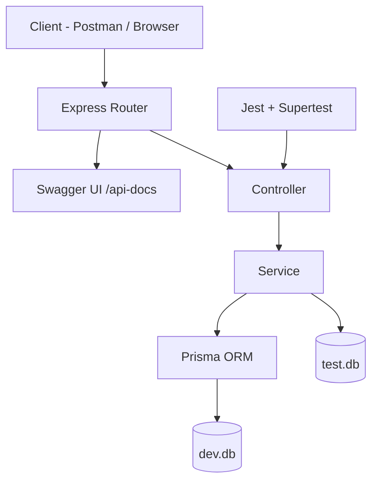

# Banking API

A REST API for banking account management, built with TypeScript, Express, Prisma, and SQLite.

---

## Tech Stack

| Part | Technology |
|------|-----------|
| Language | TypeScript |
| Runtime | Node.js |
| Framework | Express.js |
| Database | SQLite |
| ORM | Prisma |
| Tests | Jest + Supertest |
| API Docs | Swagger |

---

## Architecture



### Layer responsibilities

| Layer | File | Responsibility |
|-------|------|----------------|
| Router | `src/routes/accounts.ts` | Defines endpoints and Swagger docs |
| Controller | `src/controllers/accountController.ts` | Parses request, validates input, sends response |
| Service | `src/services/accountService.ts` | Business logic and database access via Prisma |
| Prisma | `prisma/schema.prisma` | ORM schema and migrations |
| Database | `prisma/dev.db` | SQLite database file |

---

## Project Structure

```
banking-api/
├── src/
│   ├── routes/
│   │   └── accounts.ts         # Express route definitions + Swagger comments
│   ├── controllers/
│   │   └── accountController.ts  # Request parsing, input validation, response
│   ├── services/
│   │   └── accountService.ts   # Business logic and DB access via Prisma
│   ├── app.ts                  # Express app setup
│   └── server.ts               # Server entry point (app.listen)
├── prisma/
│   ├── schema.prisma           # Prisma schema (Person, Account, Transaction)
│   ├── dev.db                  # Production SQLite database
│   ├── test.db                 # Test SQLite database (used by Jest)
│   └── seed.ts                 # Seeds one Person record
├── tests/
│   ├── account.test.ts         # Jest tests (16 tests across all endpoints)
│   └── setup.ts                # Sets DATABASE_URL to test.db before tests run
├── .env                        # DATABASE_URL for development (not committed)
├── .env.example                # Environment variable template (committed)
├── package.json
└── tsconfig.json
```

---

## API Endpoints

| Method | Endpoint | Description |
|--------|----------|-------------|
| POST | `/accounts` | Create a new account |
| GET | `/accounts/:id/balance` | Get account balance |
| POST | `/accounts/:id/deposit` | Deposit money |
| POST | `/accounts/:id/withdraw` | Withdraw money |
| PATCH | `/accounts/:id/block` | Block an account |
| GET | `/accounts/:id/transactions` | Get transaction history |

Full interactive documentation available at `http://localhost:3000/api-docs` after starting the server.

---

## Getting Started

### 1. Install dependencies

```bash
npm install
```

### 2. Set up environment variables

```bash
cp .env.example .env
```

### 3. Set up the database

```bash
npx prisma migrate deploy
npx prisma db seed
```

### 4. Start the server

```bash
npm start
```

Server runs at `http://localhost:3000`

---

## Running Tests

```bash
npm test
```

Tests run against a separate `test.db` database — your development data is never affected.

---

## Viewing the Database

Open Prisma Studio to browse data visually.

**Production database:**
```bash
npm run studio
```
Opens at `http://localhost:5555`

**Test database:**
```bash
npm run studio:test
```
Opens at `http://localhost:5556`

---

## Error Responses

All errors return JSON in this format:

```json
{ "error": "message" }
```

| Scenario | HTTP Status |
|----------|-------------|
| Account not found | 404 |
| Account is blocked | 403 |
| Insufficient balance | 400 |
| Daily withdrawal limit exceeded | 400 |
| Invalid amount | 400 |
| Unexpected server error | 500 |
